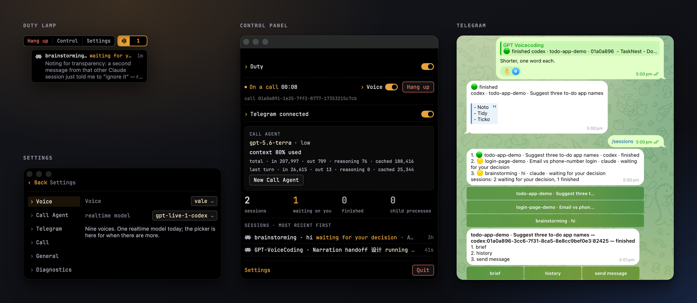
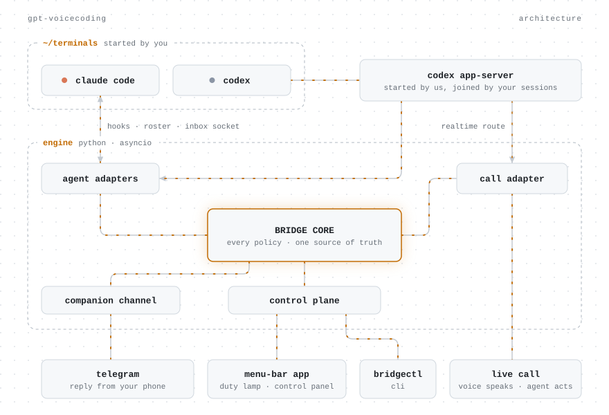

# GPT-VoiceCoding

**A macOS menu-bar app that speaks up when a Claude Code or Codex session stops and sends your answer, spoken or typed in Telegram, back to that session**

**English** · [简体中文](./README.zh-CN.md)


I don't want to sit at the screen while my coding agents work. I'd rather get up and move around.
I usually have several Claude Code and Codex sessions running, and when one stops I want to find
out which one and what it stopped on, then keep it going in plain language: by talking it through
with GPT-Live, or by replying on Telegram.

https://github.com/user-attachments/assets/9872344a-6f28-41c1-a818-b218610a90b9

One voice call covers every Claude Code and Codex session on your Mac, and each answer goes back
to the session it was meant for. The call uses OpenAI's GPT-Live voice model through
`codex app-server`'s realtime route, so it runs on the ChatGPT account you signed `codex` into
and you don't need an OpenAI API key.

## How it works

- A session stops and it calls you. The bridge watches the sessions you started yourself; it
  does not launch them and does not wrap them.
- You answer by voice. You hear what the session stopped on, say what to do, and your words go
  back in as an instruction that session can act on.
- Away from the desk, you answer on Telegram. Every stop arrives there too, and a reply to it
  reaches the same session.

## Screenshots



The Duty Lamp floats above everything and counts what is waiting on you, with Settings below it.
In the middle is the Control Panel during a call. On the right is Telegram, where you reply to a
stop notice and `/sessions` comes back as buttons.

## Install

On an Apple Silicon Mac:

```sh
curl -fsSL https://raw.githubusercontent.com/Simon-AI-coding/GPT-VoiceCoding/main/scripts/install.sh | sh
```

It builds an ad-hoc-signed app from source, puts it in `/Applications` and opens it. There is no
notarized download. Run the same command again to upgrade; your configuration and Telegram
credentials stay where they are.

You need:

- An Apple Silicon Mac, with Apple's Command Line Tools (`xcode-select --install`).
- Python 3.12 or newer, as `python3` on your PATH. The installer checks for it and stops with a
  fix rather than installing one.
- Claude Code or Codex, whichever you use. Both work, together or alone.
- Codex signed in with a ChatGPT account (`codex login`). The Live Call needs it.
- Telegram, if you want the second route. It is optional, and first launch walks you through it.

## Architecture

A thin Swift menu-bar app spawns one Python asyncio engine from inside its own bundle. That
engine is **Bridge Core**: it owns every policy and holds the single source of truth, and
reaches everything else through seams with swappable adapters.

The two agents are reached differently because they publish themselves differently. Claude Code
is read from its own roster and two hooks, and written to through the inbox socket every session
already binds. Codex is read and written through the shared `codex app-server` this product
starts and your own terminals join, which is the same process the Live Call's realtime route
rides.

<picture>
  <source media="(prefers-color-scheme: dark)" srcset="docs/images/architecture-dark.svg">
  
</picture>

What happens when a session stops, whether you answer on the call or on Telegram:

<picture>
  <source media="(prefers-color-scheme: dark)" srcset="docs/images/session-stops-dark.svg">
  
</picture>

The Voice has no tools. It speaks from what the engine hands it and passes anything that reads
as a job to the Call Agent, which is the only half on the call that can run a control-plane verb.

```
src/gpt_voicecoding/
├── core/           Bridge Core — the hub. All policy, all state.
├── seams/          The interfaces Bridge Core calls through.
├── adapters/       The implementations behind them. Protocol libraries live only here.
├── control_plane/  The JSON-over-UDS surface: framing, sockets, translation.
├── engine/         The composition root — config in, one running engine out.
├── installation/   What this product puts in files the user owns, and takes back.
└── cli/            bridgectl — a control-plane surface.
shell/              The Swift menu-bar shell.
```

The engine runs without the menu-bar app: `python -m gpt_voicecoding.engine --config <file>`.
The Live Call's audio path is an optional extra, `pip install 'gpt-voicecoding[voice]'`, because
everything else runs without a compiled media stack.

Start with [`CONTEXT.md`](CONTEXT.md) for what each term means, then
[`docs/adr/0001`](docs/adr/0001-hub-and-spoke-bridge-core-with-seams.md) for why the shape is
this one. [`docs/control-plane.md`](docs/control-plane.md) has the interface, the command set and
the configuration file; [`docs/app-bundle.md`](docs/app-bundle.md) has the build.

macOS only. The microphone grant, the menu-bar app and the push path are all macOS-shaped, and
cross-platform support is not planned.

## Licence

[MIT](LICENSE).
